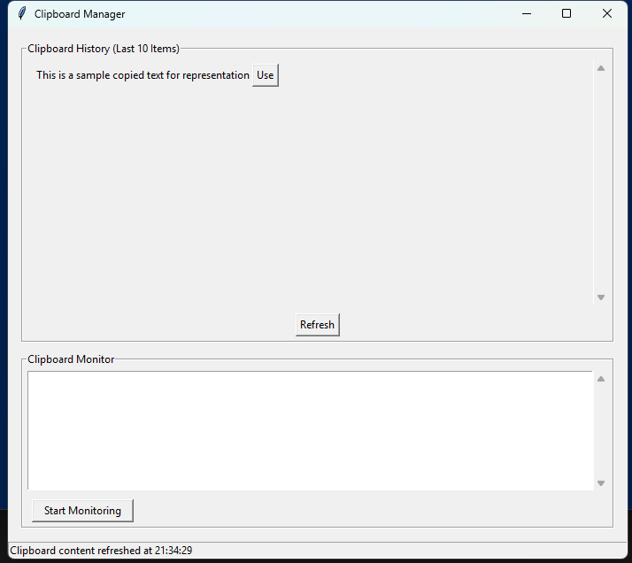

# System Utilities Collection

A comprehensive collection of cross-platform system utilities built with Python to enhance productivity and automate common tasks.

## Current Utilities

### Clipboard Utilities
Tools for accessing and manipulating clipboard content across different operating systems:

- **PyPerClip**: Simple cross-platform clipboard access
- **Win32Clipboard**: Advanced Windows clipboard manipulation
- **Tkinter Clipboard**: Framework-based clipboard operations
- **Clipboard GUI Manager**: Full-featured clipboard management application with:
  - Clipboard history (last 10 items)
  - Content monitoring with timestamps
  - One-click clipboard restoration from history

*See the [clipboard documentation](clipboard/README.md) for detailed information.*

## Features Overview

### Clipboard Manager GUI


The Clipboard Manager provides a user-friendly interface for:
- Viewing clipboard history (last 10 unique items)
- Setting any historical item as the current clipboard content
- Monitoring clipboard changes in real-time
- Status updates with timestamps

Run it with:
```bash
python clipboard/tkinter_clibboard_gui.py
```

## Usage

Utilities are organized in separate directories with their own documentation and examples. Navigate to the specific utility directory to learn more about its usage.

```bash
cd [utility-directory]
python [utility-script].py
```

## Contributing

Contributions are welcome! If you'd like to add a new utility or improve an existing one:

1. Fork the repository
2. Create a feature branch (`git checkout -b feature/amazing-utility`)
3. Commit your changes (`git commit -m 'Add amazing utility'`)
4. Push to the branch (`git push origin feature/amazing-utility`)
5. Open a Pull Request

## License

This project is licensed under the MIT License - see the LICENSE file for details. 